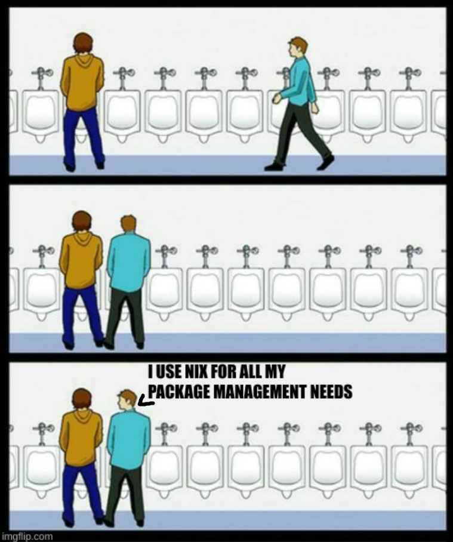
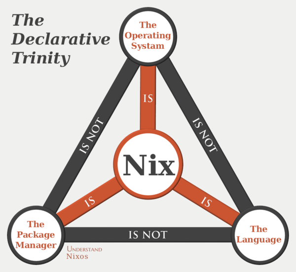
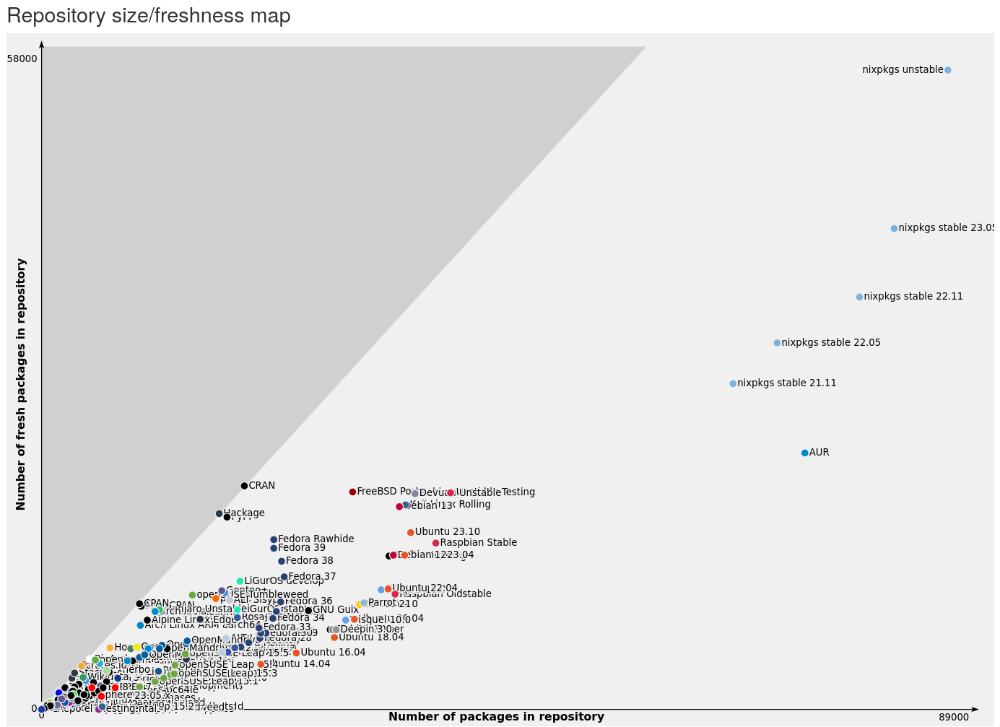
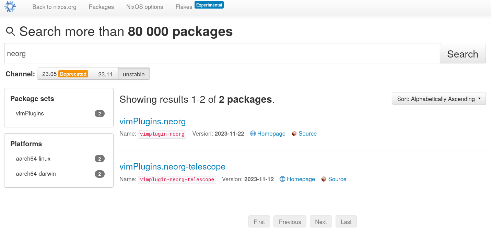

Nixvim: Configure Neovim with the power of Nix
---


<!-- end_slide -->
What is Nix ?
---
<!-- column_layout: [1, 2] -->

<!-- column: 0 -->


<!-- pause -->

<!-- column: 1 -->



<!-- pause -->
- A functional programming language
<!-- pause -->
- A package manager and repository (`nixpkgs`)
  - Available on  & 
<!-- pause -->
- An operating system (NixOS)

<!-- end_slide -->
Nixpkgs: the nix package repository
---

<!-- column_layout: [2, 3] -->

<!-- column: 0 -->


<!-- pause -->

<!-- column: 1 -->
- ~80,000 package



<!-- end_slide -->
Vim plugins too !
---




```sh
nix-repl> lib.length (lib.attrNames vimPlugins)
1547
```

<!-- end_slide -->
NixOS: A declarative and reproducible Linux distribution
---


<!-- pause -->
- Declarative

Your entire system define in a config file (`configuration.nix`)
<!-- pause -->
- Reproducible
<!-- pause -->
- Based on the nix package manager

<!-- end_slide -->
A config file for your distro
---

```nix
# /etc/nixos/configuration.nix
{
  time.timeZone = "Europe/Paris";

  # Install some packages
  environment.systemPackages = with pkgs; [
    firefox
    git
    mpv
  ];

  # Enable SSH server
  services.openssh = {
    enable = true;
    settings.PasswordAuthentication = false;
  };

  services.xserver = {
    enable = true;
    # Install Gnome
    desktopManager.gnome.enable = true;
  };
}
```

<!-- end_slide -->
Home-manager: Manage your user environment using Nix
---

Same idea... for the home environment !
<!-- pause -->

Features:
- Installs programs
- Configures them
- Can configure every bit of your `$HOME`
- Runs on [    ]
<!-- pause -->

=> The ultimate ricing tool

<!-- end_slide -->
Home-manager: Manage your user environment using Nix
---


<!-- column_layout: [1, 1] -->

<!-- column: 0 -->
```nix
{

  # Shell aliases
  home.shellAliases.rm = "rm -iv";

  # Environment variables
  home.sessionVariables = {
    CARGO_HOME = "~/.local/share/cargo";
  };

  home.packages = with pkgs; [
    gcc
    steam
    libreoffice
  ];

  programs.tmux = {
    enable = true;
    keyMode = "vi";
  };
}
```

<!-- column: 1 -->
```nix
{
  programs.git = {
    userEmail = "gaetan@glepage.com";
    userName = "Gaetan Lepage";
  };

  services.redshift.enable = true;

  wayland.windowManager.sway = {
    enable = true;
    window.titlebar = false;
    startup = [{command = "firefox";}];

    fonts = {
      names = ["DejaVu Sans Mono"];
      size = 12.0;
    };
  };
}
```

<!-- end_slide -->
Neovim configuration in Home-manager
---
<!-- column_layout: [1, 1] -->

<!-- column: 0 -->
Can we configure Neovim with Home-manager ?
<!-- pause -->
Of course !
<!-- pause -->
- Handles plugin installation
- Raw vimscript/lua configuration
- ... but not very convenient.

<!-- column: 1 -->
```nix
{
  programs.neovim = {
    enable = true;
    defaultEditor = true;

    extraPackages = [
      pkgs.rust-analyzer
      pkgs.shfmt
    ];

    plugins = [
      pkgs.vimPlugins.telescope
      {
        plugin = pkgs.vimPlugins.vimtex;
        config = "let g:vimtex_enabled = 1";
      }
    ];

    extraLuaConfig = ''
      vim.opt.relativenumber = true

      require('telescope').setup()
    '';
  };
}
```

<!-- end_slide -->
Nixvim
---


<!-- pause -->
Apply the same idea as NixOS/Home-manager to Neovim configuration
<!-- pause -->
- Installs neovim
- Installs plugins
- Installs required packages (language servers, formatters...)
- Generate `init.lua`

_Guarantee to get your custom version of Neovim 100% ready to go._

<!-- pause -->

**Not a Neovim distribution !**

<!-- end_slide -->
Options and globals
---

```nix
{
  options = {
    updatetime = 100; # Faster completion
    fileencoding = "utf-8"; # File-content encoding for the current buffer
    relativenumber = true; # Relative line numbers
  };

  globals = {
    mapleader = " ";
    maplocalleader = " ";
  };
}
```

<!-- end_slide -->
Basic settings
---

```nix
{
  colorschemes.gruvbox = true;

  # Filetype associations (`vim.filetype.add`)
  filetype.extension.typ = "typst";

  # Highlight groups (`vim.api.nvim_set_hl`)
  highlight = {
    Comment.fg = "#ff0000";
  };
}
```

<!-- end_slide -->
Set keymaps
---

```nix
{
  keymaps = [
    # nvim_set_keymap("", "<M-k>", ":move-2<CR>")
    {
      key = "<M-k>";
      action = ":move-2<CR>";
    }

    # nvim_set_keymap("n", "<C-t>", vim.lsp.buf.format, {silent = true})
    {
      mode = "n";
      key = "<C-t>";
      action = "vim.lsp.buf.format";
      lua = true;
      options.silent = true;
    }
  ];
}
```

<!-- end_slide -->
Set autocommands and augroups
---

```nix
{
  autoGroups = {
    my_augroup = {
      clear = true;
    };
  };

  autoCmd = [
    {
      event = ["BufEnter" "BufWinEnter"];
      pattern = ["*.c" "*.h"];
      command = "echo 'Entering a C or C++ file'";
      group = "my_augroup";
    }
  ];
}
```

<!-- end_slide -->
Install and configure plugins
---

```nix
{
  plugins = {
    harpoon = {
      enable = true;

      keymaps = {
        addFile = "<leader>a";
        toggleQuickMenu = "<C-e>";
      };
    };

    telescope = {
      enable = true;

      defaults.file_ignore_patterns = [ "^.git/" ];
      keymaps."<C-p>" = "git_files";
    };
  };
}
```

<!-- pause -->
... and 164 more included plugins !

(neotree, fugitive, nvim-dap, nvim-cmp...)

<!-- end_slide -->
LSP and completions
---

```nix
{
  plugins = {
    lsp = {
      enable = true;

      servers = {
        nil_ls.enable = true;
        tsserver.enable = true;

        rust-analyzer = {
          enable = true;
          installCargo = true;

          autostart = true;

          settings = {
            numThreads = 16;
            runnables.extraArgs = ["--release"];
          };
        };
      };
    };
  };
}
```

<!-- end_slide -->
Extensible !
---

```nix
{
  extraPackages = [
    pkgs.git
  ];

  extraPlugins = [
    pkgs.vimPlugins.lir-nvim
  ];

  extraConfigLua = ''
    require('lir').setup({
      show_hidden_files = false,
    })
  '';
}
```

<!-- end_slide -->
Installation methods
---
<!-- pause -->
- NixOS module [  ]
- Home-manager module [    ]

=> Installs neovim and applies the configuration
```nix
{
  programs.nixvim = {
    # ...
  };
}
```
<!-- pause -->

- Standalone flake [    ]


```
┌────────────────────────┐              ┌──────┐
│         Inputs         │  flake.nix   │ nvim │
│ (nixpkgs, nixvim, ...) │ ───────────> │      │
└────────────────────────┘              └──────┘
```


<!-- end_slide -->
Thanks for listening !
---

# Get in touch

* 󰖟 glepage.com
*  GaetanLepage
* 󰫑 @glepage@fosstodon.org
*  @GaetanLepage_

<!-- pause -->

# Resources:
* _󰖟  nixos.org_
* _  github.com/nix-community/nixvim_
* _󰗃  youtube.com/@vimjoyer_

<!-- pause -->

# Nixvim contributors:
- Pedro Alves _(@pta2002_), original creator
- Quentin Boyer (_@traxys_)
