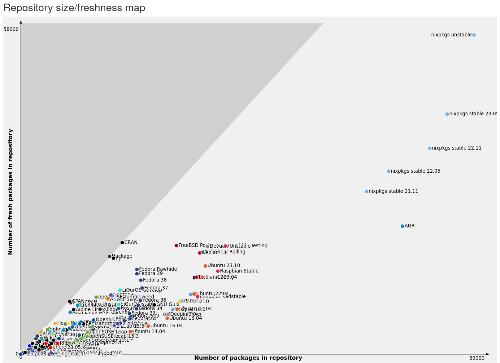

Nixvim: Configure Neovim with the power of Nix
---

<!-- end_slide -->
What is Nix ?
---

- A functional programming language
<!-- pause -->
- A package manager (`nixpkgs`)
<!-- pause -->
- An operating system (NixOS)

<!-- end_slide -->
Nixpkgs: the nix package repository
---

- ~80,000 package

<!-- end_slide -->

<!-- end_slide -->
Thanks for listening !
---

* 󰖟 glepage.com
* 󰫑 @glepage@fosstodon.org
*  @GaetanLepage_

