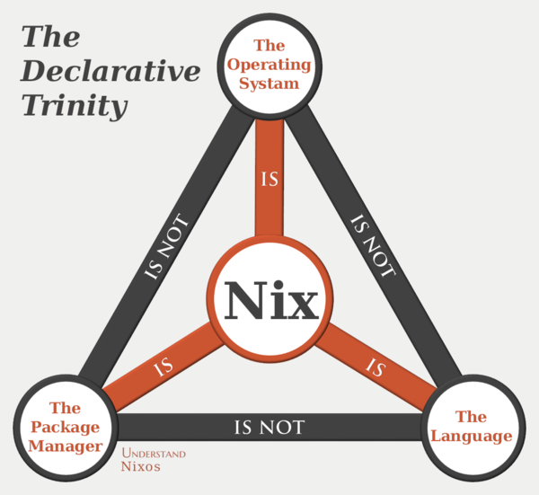
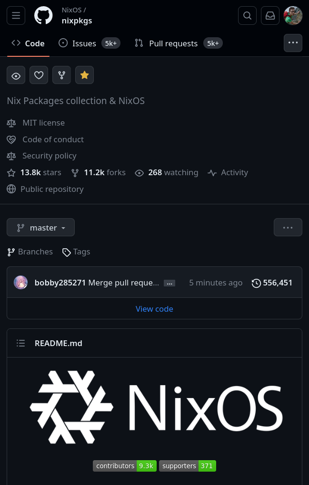
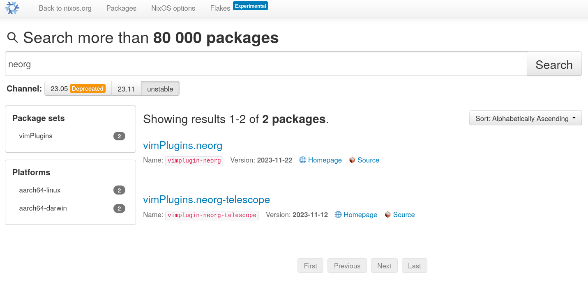

Nixvim: Configure Neovim with the power of Nix
---


<!-- end_slide -->
What is Nix ?
---
<!-- column_layout: [1, 2] -->

<!-- column: 0 -->


<!-- pause -->

<!-- column: 1 -->



<!-- pause -->
- A functional programming language
<!-- pause -->
  - Lets you write derivations
<!-- pause -->
- A package manager and repository (`nixpkgs`)
<!-- pause -->
- An operating system (NixOS)

<!-- end_slide -->
Nixpkgs: the nix package repository
---

<!-- column_layout: [2, 3] -->

<!-- column: 0 -->


<!-- pause -->

<!-- column: 1 -->
- ~80,000 package


<!-- end_slide -->
Vim plugins too !
---




```sh
nix-repl> lib.length (lib.attrNames vimPlugins)
1547
```

<!-- end_slide -->
NixOS: A declarative and reproducible Linux distribution
---


<!-- end_slide -->
Home-manager: Manage your user environment using Nix
---

Features:
- Installs programs
- Configures them
- Can configure every bit of your `$HOME`
<!-- pause -->

=> The ultimate ricing tool

<!-- end_slide -->
Home-manager: Manage your user environment using Nix
---


<!-- column_layout: [1, 1] -->

<!-- column: 0 -->
```nix
{

  # Shell aliases
  home.shellAliases.rm = "rm -iv";

  # Environment variables
  home.sessionVariables = {
    CARGO_HOME = "~/.local/share/cargo";
  };

  home.packages = [
    pkgs.gcc
    pkgs.steam
    pkgs.libreoffice
  ];

  programs.tmux = {
    enable = true;
    keyMode = "vi";
  };
}
```

<!-- column: 1 -->
```nix
{
  programs.git = {
    userEmail = "gaetan@glepage.com";
    userName = "Gaetan Lepage";
  };

  xdg = {
    enable = true;
    userDirs = {
      enable = true;
      desktop = "/home/gaetan/Bureau";
    };
  };

  sway = {
    enable = true;
    window.titlebar = false;
    startup = [{command = "firefox";}];

    fonts = {
      names = ["DejaVu Sans Mono"];
      size = 12.0;
    };
  };
}
```

<!-- end_slide -->
Neovim configuration in Home-manager
---
<!-- column_layout: [1, 2] -->

<!-- column: 0 -->
Can we configure Neovim with Home-manager ?
<!-- pause -->
Of course !
<!-- pause -->
- Handles plugin installation
- Raw vimscript/lua configuration
- ... but not very convenient.

<!-- column: 1 -->
```nix
{
  programs.neovim = {
    enable = true;
    defaultEditor = true;

    extraPackages = [
      pkgs.rust-analyzer
      pkgs.shfmt
    ];

    plugins = [
      pkgs.vimPlugins.telescope
      {
        plugin = pkgs.vimPlugins.vimtex;
        config = "let g:vimtex_enabled = 1";
      }
    ];

    extraLuaConfig = ''
      vim.opt.relativenumber = true

      require('telescope').setup()
    '';
  };
}
```

<!-- end_slide -->
Nixvim
---


<!-- pause -->
Apply the same idea as NixOS/Home-manager to Neovim configuration
<!-- pause -->
- Installs neovim
- Installs plugins
- Installs required packages (language servers, formatters...)
- Generate `init.lua`

_Guarantee to get your custom version of Neovim 100% ready to go._

<!-- end_slide -->
Basic settings
---

```nix
{
  colorschemes.gruvbox = true;

  # Filetype associations (`vim.filetype.add`)
  filetype.extension.typ = "typst";

  # Highlight groups (`vim.api.nvim_set_hl`)
  highlight = {
    Comment.fg = "#ff0000";
  };
}
```


<!-- end_slide -->
Set keymaps
---

```nix
{
  keymaps = [
    # nvim_set_keymap("", "<M-k>", ":move-2<CR>")
    {
      key = "<M-k>";
      action = ":move-2<CR>";
    }

    # nvim_set_keymap("n", "<C-t>", vim.lsp.buf.format, {silent = true})
    {
      mode = "n";
      key = "<C-t>";
      action = "vim.lsp.buf.format";
      lua = true;
      options.silent = true;
    }
  ];
}
```

<!-- end_slide -->
Set autocommands and augroups
---

```nix
{
  autoGroups = {
    my_augroup = {
      clear = true;
    };
  };

  autoCmd = [
    {
      event = ["BufEnter" "BufWinEnter"];
      pattern = ["*.c" "*.h"];
      command = "echo 'Entering a C or C++ file'";
      group = "my_augroup";
    }
  ];
}
```

<!-- end_slide -->
Installation methods
---
<!-- pause -->
- NixOS module
- Home-manager module

=> Installs neovim and applies the configuration
```nix
{
  programs.nixvim = {
    # ...
  };
}
```
<!-- pause -->

- Standalone flake 


<!-- end_slide -->
Thanks for listening !
---

# Get in touch

* 󰖟 glepage.com
* 󰫑 @glepage@fosstodon.org
*  GaetanLepage
*  @GaetanLepage_

# Resources:
* _󰖟  nixos.org_
* _  github.com/nix-community/nixvim_
* _󰗃 youtube.com/@vimjoyer_
